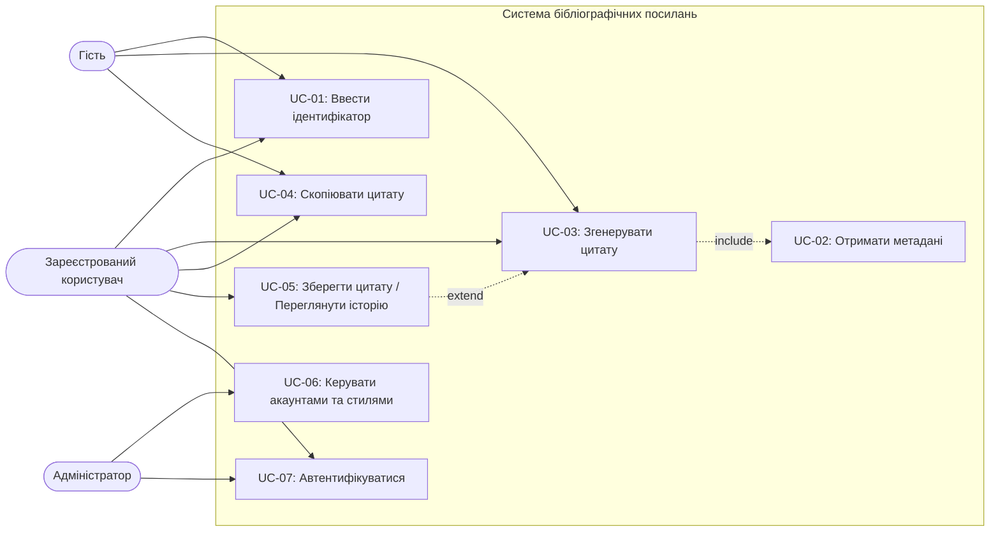
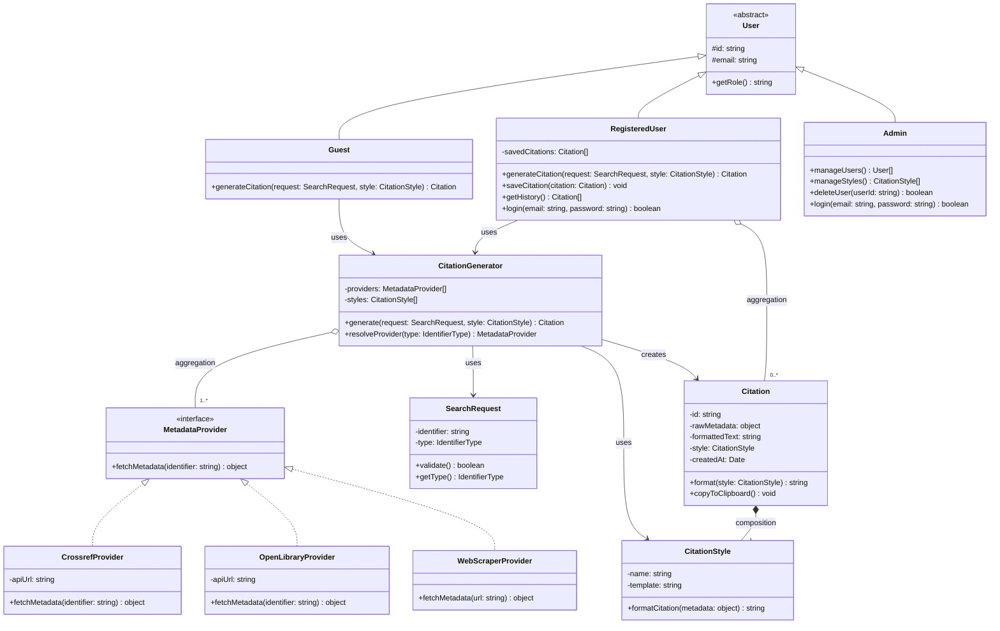
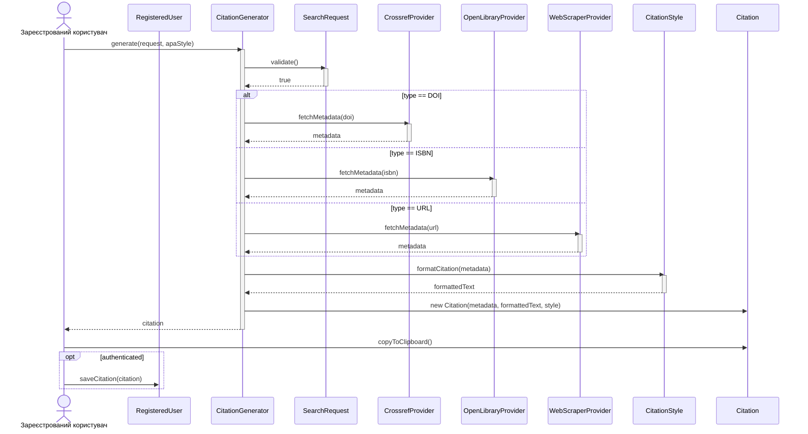

# bse-lr2-konovalov

Лабораторна робота №2 з дисципліни "Основи програмної інженерії"

**Тема:** Моделювання системи (UML)

## Автори

- **Коновалов Олександр**, група ПЗПІ-25-6, oleksandr.konovalov1@nure.ua

## Технології

- Діаграми: Mermaid
- Експорт: @mermaid-js/mermaid-cli
- VCS: Git + GitHub

## Опис проєкту

**Система створення академічних бібліографічних посилань** — веб-сервіс для автоматичного формування бібліографічних цитат на основі ідентифікатора публікації (DOI, URL або ISBN).

Сервіс підтримує популярні стилі цитування: APA, MLA, Chicago. Користувач вводить ідентифікатор, система отримує метадані через зовнішні API (Crossref для DOI, Open Library для ISBN, веб-скрапінг для URL) і генерує готове посилання, яке можна скопіювати або зберегти.

**Актори системи:**

- **Гість** — може генерувати та копіювати цитати без реєстрації
- **Зареєстрований користувач** — зберігає цитати, переглядає історію, керує обліковим записом
- **Адміністратор** — управління акаунтами, налаштування доступних стилів цитування

## Функціональні вимоги

| ID | Вимога | Актор | Пріоритет |
|----|--------|-------|-----------|
| FR-01 | Система дозволяє ввести ідентифікатор публікації (DOI, URL або ISBN) | Гість, Користувач | Must |
| FR-02 | Система отримує метадані публікації через зовнішні API (Crossref, Open Library, веб-скрапінг) | Система | Must |
| FR-03 | Система генерує бібліографічне посилання у вибраному форматі (APA, MLA, Chicago) | Гість, Користувач | Must |
| FR-04 | Користувач може скопіювати згенероване посилання у буфер обміну | Гість, Користувач | Must |
| FR-05 | Зареєстрований користувач може зберігати посилання та переглядати історію | Зареєстрований користувач | Should |
| FR-06 | Адміністратор може керувати обліковими записами та налаштуваннями стилів цитування | Адміністратор | Should |
| FR-07 | Система підтримує автентифікацію користувачів через email-реєстрацію | Гість → Користувач | Must |

## Діаграма прецедентів

Виконав: Коновалов Олександр



## Діаграма класів




## Діаграма послідовності


Сценарій: Зареєстрований користувач генерує цитату у форматі APA за DOI



## Матриця трасовності

| FR | Прецедент | Задіяні класи | Діаграма послідовності |
|----|-----------|---------------|----------------------|
| FR-01 | UC-01: Ввести ідентифікатор | SearchRequest | Кроки 1-3 (validate) |
| FR-02 | UC-02: Отримати метадані | MetadataProvider, CrossrefProvider, OpenLibraryProvider, WebScraperProvider | Кроки 4-5 (fetchMetadata) |
| FR-03 | UC-03: Згенерувати цитату | CitationGenerator, CitationStyle, Citation | Кроки 6-9 (formatCitation, create) |
| FR-04 | UC-04: Скопіювати цитату | Citation | Крок 10 (copyToClipboard) |
| FR-05 | UC-05: Зберегти / Історія | RegisteredUser, Citation | Крок 11 (saveCitation) |
| FR-06 | UC-06: Керувати акаунтами | Admin, User, CitationStyle | Не показано (сценарій адміна) |
| FR-07 | UC-07: Автентифікуватися | User, RegisteredUser, Admin | Не показано (сценарій автентифікації) |

## Встановлення

```bash
git clone https://github.com/oleksandrkonovalov1/bse-lr2-konovalov.git
cd bse-lr2-konovalov
npm install
npm run export:all
```

## Ліцензія

MIT License
