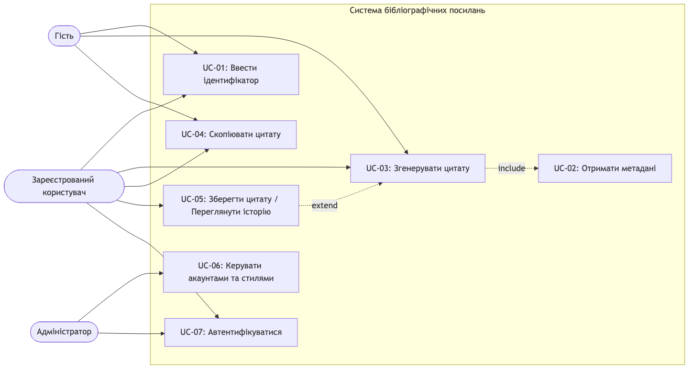
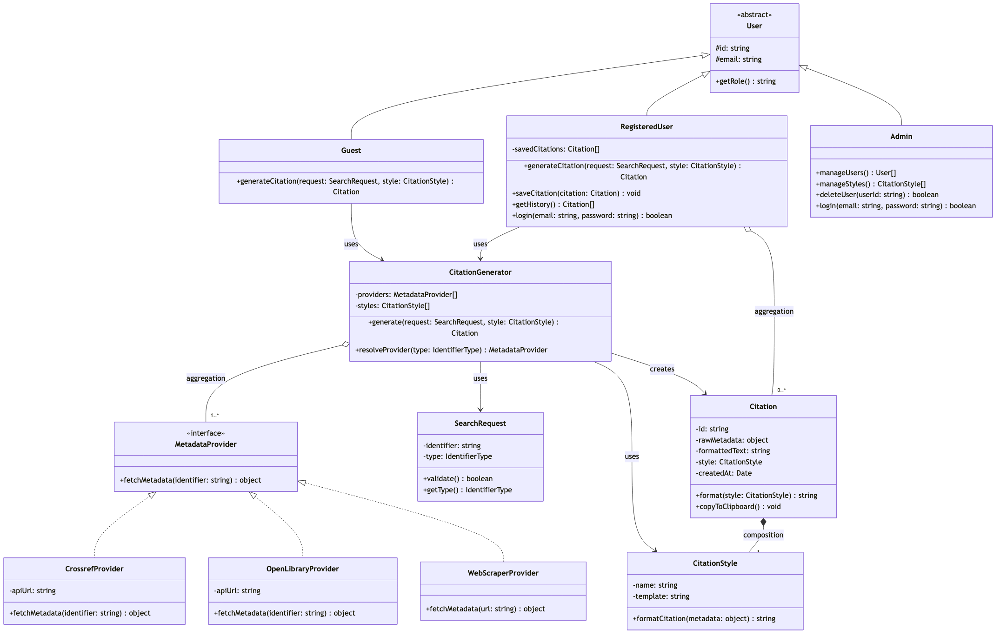
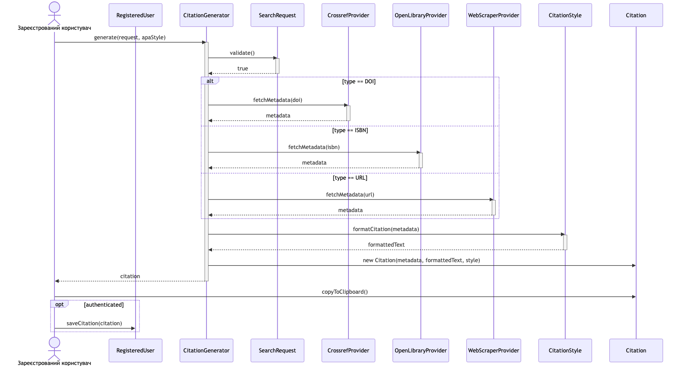

# Звіт з лабораторної роботи № 2

## Основи програмної інженерії

---

**Дисципліна:** Основи програмної інженерії

**Тема:** Моделювання системи (UML)

**Виконав:** студент групи ПЗПІ-25-6 **Коновалов Олександр**

**Email:** oleksandr.konovalov1@nure.ua

**Репозиторій:** https://github.com/oleksandrkonovalov1/bse-lr2-konovalov

---

## 1. Опис предметної області

Система створення академічних бібліографічних посилань — веб-сервіс для автоматичного формування бібліографічних цитат на основі ідентифікатора публікації (DOI, URL або ISBN).

Сервіс підтримує стилі цитування APA, MLA, Chicago. Користувач вводить ідентифікатор, система отримує метадані через зовнішні API (Crossref для DOI, Open Library для ISBN, веб-скрапінг для URL) і генерує готове посилання.

Актори:
- **Гість** — генерація та копіювання цитат без реєстрації
- **Зареєстрований користувач** — збереження цитат, перегляд історії
- **Адміністратор** — управління акаунтами, налаштування стилів

---

## 2. Функціональні вимоги

| ID | Вимога | Актор | Пріоритет |
|----|--------|-------|-----------|
| FR-01 | Система дозволяє ввести ідентифікатор публікації (DOI, URL або ISBN) | Гість, Користувач | Must |
| FR-02 | Система отримує метадані публікації через зовнішні API (Crossref, Open Library, веб-скрапінг) | Система | Must |
| FR-03 | Система генерує бібліографічне посилання у вибраному форматі (APA, MLA, Chicago) | Гість, Користувач | Must |
| FR-04 | Користувач може скопіювати згенероване посилання у буфер обміну | Гість, Користувач | Must |
| FR-05 | Зареєстрований користувач може зберігати посилання та переглядати історію | Зареєстрований користувач | Should |
| FR-06 | Адміністратор може керувати обліковими записами та налаштуваннями стилів цитування | Адміністратор | Should |
| FR-07 | Система підтримує автентифікацію користувачів через email-реєстрацію | Гість → Користувач | Must |

Кожна вимога є однозначною, перевірюваною та трасованою до відповідного прецеденту, класів та діаграми послідовності.

---

## 3. Діаграма прецедентів

Діаграма містить 3 актори та 7 прецедентів з межею системи.

Зв'язки:
- **include:** UC-03 (Згенерувати цитату) включає UC-02 (Отримати метадані) — генерація цитати обов'язково потребує отримання метаданих
- **extend:** UC-05 (Зберегти цитату) розширює UC-03 — збереження є опціональним продовженням генерації (тільки для зареєстрованих)



---

## 4. Діаграма класів

Діаграма містить 12 класів з повними атрибутами та методами.

Ієрархія наслідування:
- **User** (abstract) → Guest, RegisteredUser, Admin
- **MetadataProvider** (interface) → CrossrefProvider, OpenLibraryProvider, WebScraperProvider

Зв'язки:
- **Агрегація:** CitationGenerator o-- MetadataProvider (1..*), RegisteredUser o-- Citation (0..*)
- **Композиція:** Citation *-- CitationStyle (1)
- **Залежність:** CitationGenerator --> SearchRequest, CitationGenerator --> Citation (creates)



---

## 5. Діаграма послідовності

Обраний сценарій: "Зареєстрований користувач генерує цитату у форматі APA за DOI"

Учасники: Зареєстрований користувач, RegisteredUser, CitationGenerator, SearchRequest, CrossrefProvider, OpenLibraryProvider, WebScraperProvider, CitationStyle, Citation

Елементи діаграми:
- **Лінії життя** для всіх учасників
- **Смуги активації** на CitationGenerator, SearchRequest, CrossrefProvider, CitationStyle
- **Синхронні повідомлення** (суцільні стрілки) та **зворотні повідомлення** (пунктирні стрілки)
- **Комбінований фрагмент alt** — маршрутизація за типом ідентифікатора (DOI vs ISBN vs URL)
- **Комбінований фрагмент opt** — збереження цитати через RegisteredUser (тільки якщо автентифікований)



---

## 6. Матриця трасовності

| FR | Прецедент | Задіяні класи | Діаграма послідовності |
|----|-----------|---------------|----------------------|
| FR-01 | UC-01: Ввести ідентифікатор | SearchRequest | Кроки 1-3 (validate) |
| FR-02 | UC-02: Отримати метадані | MetadataProvider, CrossrefProvider, OpenLibraryProvider, WebScraperProvider | Кроки 4-5 (fetchMetadata) |
| FR-03 | UC-03: Згенерувати цитату | CitationGenerator, CitationStyle, Citation | Кроки 6-9 (formatCitation, create) |
| FR-04 | UC-04: Скопіювати цитату | Citation | Крок 10 (copyToClipboard) |
| FR-05 | UC-05: Зберегти / Історія | RegisteredUser, Citation | Крок 11 (saveCitation) |
| FR-06 | UC-06: Керувати акаунтами | Admin, User, CitationStyle | Не показано (сценарій адміна) |
| FR-07 | UC-07: Автентифікуватися | User, RegisteredUser, Admin | Не показано (сценарій автентифікації) |

Всі 7 функціональних вимог покриті прецедентами та класами. 5 з 7 вимог відображені в діаграмі послідовності (основний сценарій генерації цитати).

---

## 7. Технології та інструменти

| Інструмент | Призначення |
|------------|-------------|
| Mermaid | Створення діаграм у текстовому форматі |
| @mermaid-js/mermaid-cli | Експорт діаграм у PNG |
| Git + GitHub | Контроль версій, хостинг коду |

---

## 8. Структура репозиторію

```
bse-lr2-konovalov/
├── .gitignore
├── README.md
├── package.json
├── diagrams/
│   ├── use-case.mmd
│   ├── class.mmd
│   ├── sequence.mmd
│   └── images/
│       ├── use-case.png
│       ├── class.png
│       └── sequence.png
└── reports/lr2/
    └── report.md
```

---

## 9. Посилання

- **Репозиторій:** https://github.com/oleksandrkonovalov1/bse-lr2-konovalov
